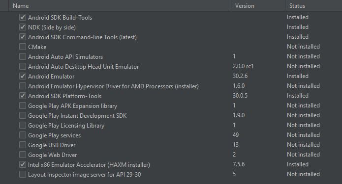

# Setup / installation of the project

This documentation only works if you have an **INTEL** processor, and your on **windows**.

## Flutter installation

[Download this .zip (Flutter 1.22.4 version)](https://storage.googleapis.com/flutter_infra/releases/stable/windows/flutter_windows_1.22.4-stable.zip) and follow the next steps

- unzip the file
- Place your file in your PC (**Preferably not** in your programm files)
- Add flutter in your enviroment variables

To check if flutter was proplerly installed, type in a terminal "flutter doctor". This will see if there are any platform dependencies you need to complete the setup.

## Android studio version 4.1.0 installation

[Download this .zip (Android studio 4.1.0 version)](https://redirector.gvt1.com/edgedl/android/studio/ide-zips/4.1.0.19/android-studio-ide-201.6858069-windows.zip) and follow the next steps

- unzip the file
- Put your file in your PC
- Navigate to android-studio > bin, and then run the studio64 file

## Setup your SDK Manager

Open your SDK manager (Top right of your screen, or use the search bar).
Go into the SDK Tools tab and download the packages below (This picture works only if you have an intel processor)

## Create your Android Emulator

If you look top right of your screen, there is a phone icon (AVD Manager). Click on it and it will open your **AVD Manager**.

- Create Virtual Device
- Select you desired phone
- Select the most recent System Image
- Give your phone a name

Your finished, and can finally run your fultter application.
